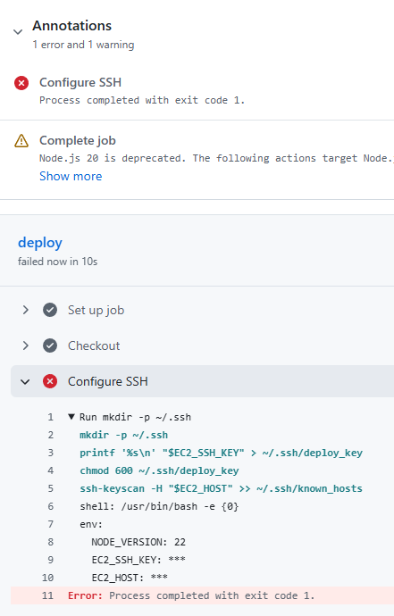
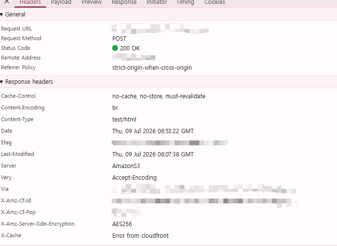
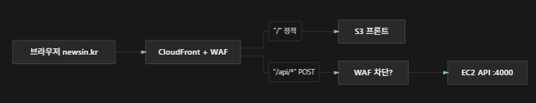
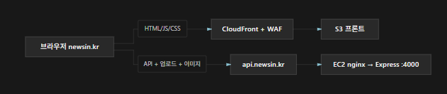
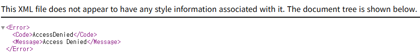
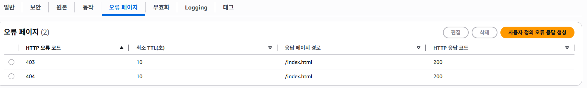

# 모노레포 기반 CMS & 뉴스 플랫폼

## 1. 프로젝트 개요 (Project Overview)

> **모노레포 아키텍처를 기반으로 자체 CMS(콘텐츠 관리 시스템)와 사용자 프론트엔드를 통합 구축하고, AWS 인프라 및 무중단 배포 환경까지 직접 설계한 풀스택 뉴스 플랫폼**

- **프로젝트 성격:** 모노레포 풀스택 뉴스 서비스 & 동적 콘텐츠 관리 시스템
- **핵심 해결 과제:**
  - 정적 호스팅(S3) 환경에서의 동적 기사 SEO(Open Graph) 및 클라이언트 사이드 라우팅(SPA) 한계 극복
  - 보안 방화벽(WAF)과 파일 업로드 API 통신 간의 충돌 해결 및 인프라 구조 최적화
- **주요 기능 요약:**
  - **실시간 동적 SEO 생성기:** 관리자의 기사 승인/수정/삭제 시 S3에 OG 메타데이터가 포함된 HTML 즉시 생성 및 CloudFront 캐시 무효화 자동화
  - **자체 커스텀 에디터(CMS):** 이미지/미디어 삽입, Rich Text 편집 및 백엔드 업로드 API 연동
  - **사용자 웹 서비스:** 카테고리별 뉴스 조회, 검색, 기사 상세 페이지 및 SNS 공유 기능
- **서비스 URL:** [https://newsin.kr/](https://newsin.kr/)

---

## 2. 기술 스택 (Tech Stack)

| 구분               | 사용 기술 / 라이브러리                                                          |
| :----------------- | :------------------------------------------------------------------------------ |
| **Architecture**   | pnpm Workspaces, Turborepo (Monorepo)                                           |
| **Frontend**       | React, TypeScript, Vite, React Router, Zustand, TanStack Query, React Hook Form |
| **Backend**        | Node.js, Express, Prisma ORM, MySQL                                             |
| **Infrastructure** | AWS (EC2, S3, CloudFront, RDS, Route53), Nginx, Certbot (SSL)                   |
| **CI/CD**          | GitHub Actions                                                                  |

---

## 3. 아키텍처 및 시스템 흐름 (Architecture)

```
[ Client Browser ]
   │
   ├─► https://newsin.kr (Frontend)
   │     └─► CloudFront (WAF 적용) ──► S3 Bucket (Static Web Hosting)
   │
   └─► https://api.newsin.kr (Backend API)
         └─► Nginx (Reverse Proxy & SSL) ──► EC2 (Express App) ──► RDS (MySQL)
```

- **프론트엔드/API 도메인 분리:** 정적 자원(S3/CloudFront)과 백엔드 API(Nginx/EC2)의 도메인을 격리하여 WAF 보안 규칙을 유지하면서도 무중단 파일 업로드 및 API 통신이 가능한 구조 설계
- **동적 S3 파일 동기화 흐름:** 관리자가 기사 승인/수정/삭제 ──► 백엔드가 해당 기사 전용 OG HTML 생성 ──► S3 특정 경로(`article/{id}/index.html`) 업로드 및 CloudFront Invalidation 트리거

---

## 4. 핵심 트러블슈팅 (Troubleshooting)

### 1) GitHub Actions 기반 자동 배포 및 네트워크 접근 제어 해결



- **문제 현상:** CI/CD 파이프라인의 `Configure SSH` 단계에서 `ssh-keyscan`이 실패하며 EC2 배포가 중단됨. `ssh-keyscan` 실패는 GitHub Actions 러너에서 EC2의 SSH 포트에 도달하지 못했다는 의미로, SSH 키 문제보다 네트워크/주소 문제일 가능성이 큼.
- **원인 분석:** 배포용 GitHub Secrets(호스트·접속 계정·배포 경로 등)와 EC2 보안 그룹(Security Group) 인바운드 규칙을 점검한 결과, SSH 규칙이 제한된 출처만 허용하고 있어 GitHub Actions 러너의 접근이 차단되고 있었음.

- **해결 방법:** 기존 SSH 규칙은 유지한 채, CI/CD 배포용 SSH 접근을 허용하는 인바운드 규칙을 추가로 등록하여 자동 배포 파이프라인을 정상화.

### 2) API 도메인 분리 및 Nginx 리버스 프록시 구축 (WAF 충돌 해결)



- **문제 현상:** 관리자 에디터에서 이미지 URL·파일 버튼·붙여넣기로 이미지를 삽입해도 input에 반영되지 않음. 업로드 API 자체는 동작하는 것처럼 보였으나, 응답 `Content-Type`이 `application/json`이 아닌 `text/html`이고 `Server: AmazonS3`로 반환됨. 프론트와 API가 동일한 CloudFront + WAF를 경유해, WAF가 관리자 미디어 업로드(멀티파트) 요청을 차단할 수 있는 구조였음.



- **원인 분석:** 처음에는 `RichBodyEditor`의 DOM 삽입·직렬화 흐름(`execCommand` → `serialize()` → 부모 `setBlocks`)과 `execCommand` 호출 시점의 커서/포커스 부재를 의심했으나, CloudFront 커스텀 403 응답을 제거하자 업로드 경로가 403으로 노출되며 **실제 원인은 CloudFront/WAF 경로의 업로드 차단**임을 확인.
- **해결 방법:** API 전용 서브도메인을 분리 개설하고, EC2에 Nginx·Certbot을 설치해 리버스 프록시와 SSL을 구성. 프론트 도메인은 WAF를 유지하고, API 도메인은 EC2로 직접 연결되도록 분리. 이후 보안 그룹에서 CDN이 백엔드 앱 포트로 직접 들어오던 인바운드 규칙을 정리하고, 앱 포트는 EC2 내부에서 Nginx → Express 프록시에만 사용하도록 변경.

```nginx
# /etc/nginx/sites-available/api.<domain>
server {
    listen 80;
    server_name api.<domain>;

    location /.well-known/acme-challenge/ {
        root /var/www/html;
    }

    location / {
        proxy_pass http://127.0.0.1:<APP_PORT>;
        proxy_http_version 1.1;
        proxy_set_header Host              $host;
        proxy_set_header X-Real-IP         $remote_addr;
        proxy_set_header X-Forwarded-For   $proxy_add_x_forwarded_for;
        proxy_set_header X-Forwarded-Proto $scheme;

        client_max_body_size 50M;
    }
}
```

- **결과:** 프론트 도메인 → 정적 자원만(WAF 유지 가능), API 도메인 → 백엔드만(WAF 우회, EC2 직접). Certbot으로 SSL 적용 후 업로드·API 통신 정상화.



- **수정해야 할 부분:** EC2 보안 그룹의 인바운드 규칙 편집
  - 수정 전: CDN이 EC2 백엔드 앱 포트로 직접 들어와야 해서 해당 포트 규칙이 필요했음
  - 수정 후: API 도메인 분리 후 앱 포트는 EC2 내부에서 Nginx가 Express로 넘길 때만 사용

### 3) React SPA의 S3/CloudFront 정적 호스팅 라우팅 해결

- **문제 현상:** 서브 라우트(`/search`, `/login`, `/article/:id` 등) 중간 경로에서 새로고침(F5) 시 S3가 `403 Access Denied` XML 에러를 반환함.



- **원인 분석:** SPA(React) 클라이언트 라우팅 설정이 빠져 있어 생기는 현상. 메인(`/`)에서 링크로 이동할 때는 이미 로드된 `index.html` 위에서 React Router가 처리하므로 정상이지만, `/search` 등에서 새로고침하면 브라우저가 S3에 해당 경로 파일을 직접 요청함. S3에는 보통 `index.html`만 있고 `/search` 같은 파일은 없으며, 퍼블릭 액세스 차단이 켜져 있으면 “파일 없음”이 **403 Access Denied XML**로 보이는 경우가 많음.

| 동작                                | 결과                                                                   |
| ----------------------------------- | ---------------------------------------------------------------------- |
| 메인(`/`)에서 링크로 이동           | `index.html`이 이미 로드됨 → React Router가 처리 → 정상                |
| `/search`, `/login` 등에서 새로고침 | 브라우저가 S3에 `/search` 파일을 직접 요청 → 파일 없음 → Access Denied |

- **해결 방법:** CloudFront 사용자 지정 에러 응답(Custom Error Pages)을 추가해 `403`/`404` 발생 시 `/index.html`을 `200 OK`로 반환하도록 설정. 이후 클라이언트 라우팅이 정상 동작함.



### 4) 동적 콘텐츠 생성에 따른 S3 정적 호스팅 및 SEO 동기화 자동화

- **문제 현상:** 새로 작성한 기사 상세 페이지(`/article/{id}`)에서 새로고침(F5) 시 Access Denied가 발생함. 목록에서 클릭해 들어가면 정상이지만, 배포 이후 생성된 기사는 S3에 해당 `index.html`이 없어 직접 URL 요청이 실패함.
- **원인 분석:** `prerender-og.mjs`는 **빌드 당시 API에 있던 기사만** `dist/article/{id}/index.html`로 만들어 S3에 올림. 배포 후 관리자가 만든 기사에는 prerender 파일이 없고, `/article/*` 경로 SPA 폴백도 미적용된 상태였음. S3 + CloudFront(OAC)에서 존재하지 않는 객체를 요청하면 XML 형태의 Access Denied가 반환됨.

```js
// prerender-og.mjs
for (const article of articles) {
  const description = article.excerpt?.trim() || article.title;

  writeOgPage(
    outDir,
    ["article", article.id],
    injectMeta(baseHtml, {
      title: `${article.title} - ${SITE_NAME}`,
      // ...
    }),
  );
}
```

| 동작               | 동작 방식                                              | 결과                                |
| ------------------ | ------------------------------------------------------ | ----------------------------------- |
| 목록에서 기사 클릭 | React Router가 `/article/:id` 처리 (클라이언트)        | 정상                                |
| F5 새로고침        | 브라우저가 `/article/{id}`를 S3/CloudFront에 직접 요청 | 해당 경로 객체 없음 → Access Denied |

- **해결 방법:** 새 기사가 업로드·게시될 때마다 S3에 `article/{id}/index.html`(OG HTML)을 업로드하고 CloudFront 캐시를 갱신하는 동기화 함수를 구축. 기사 승인·수정 시 S3 업로드/캐시 무효화, 삭제 시 S3 객체 삭제 및 캐시 무효화를 호출해 관리자 게시/수정/삭제와 S3 페이지를 항상 동기화.
