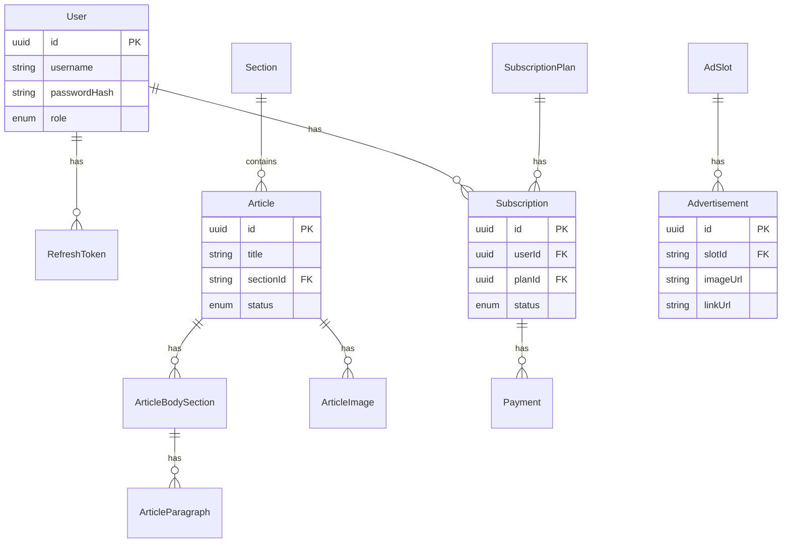

# ERD

```mermaid
erDiagram
  User ||--o{ RefreshToken : has
  User ||--o{ Subscription : has
  Section ||--o{ Article : contains
  Article ||--o{ ArticleBodySection : has
  ArticleBodySection ||--o{ ArticleParagraph : has
  Article ||--o{ ArticleImage : has
  SubscriptionPlan ||--o{ Subscription : has
  Subscription ||--o{ Payment : has
  AdSlot ||--o{ Advertisement : has

  User {
    uuid id PK
    string username
    string passwordHash
    enum role
  }

  Article {
    uuid id PK
    string title
    string sectionId FK
    enum status
  }

  Subscription {
    uuid id PK
    uuid userId FK
    uuid planId FK
    enum status
  }

  Advertisement {
    uuid id PK
    string slotId FK
    string imageUrl
    string linkUrl
  }
```
